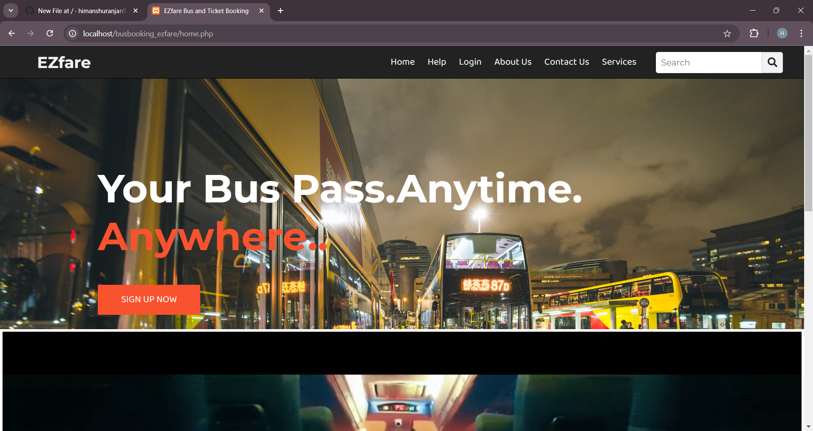
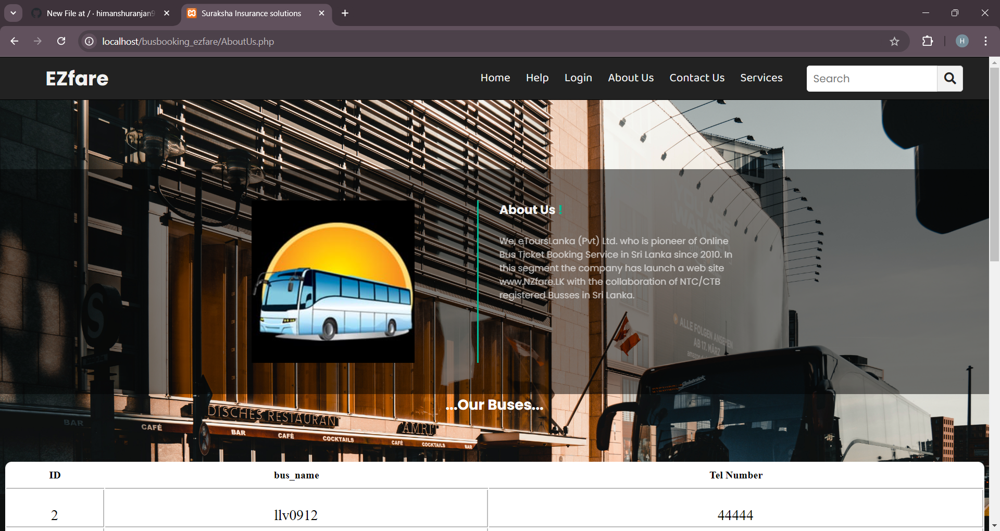
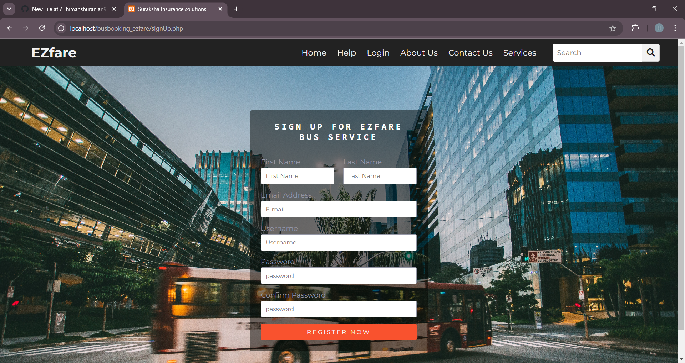
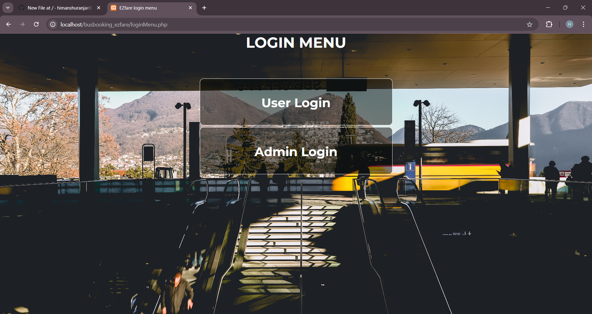
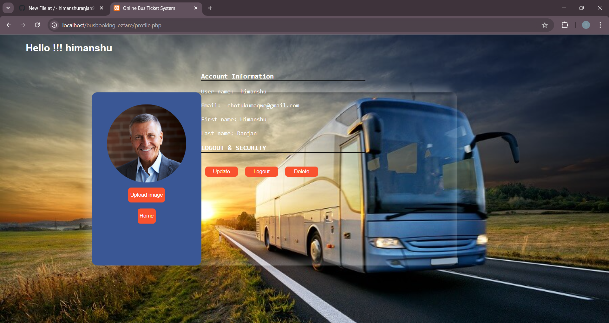
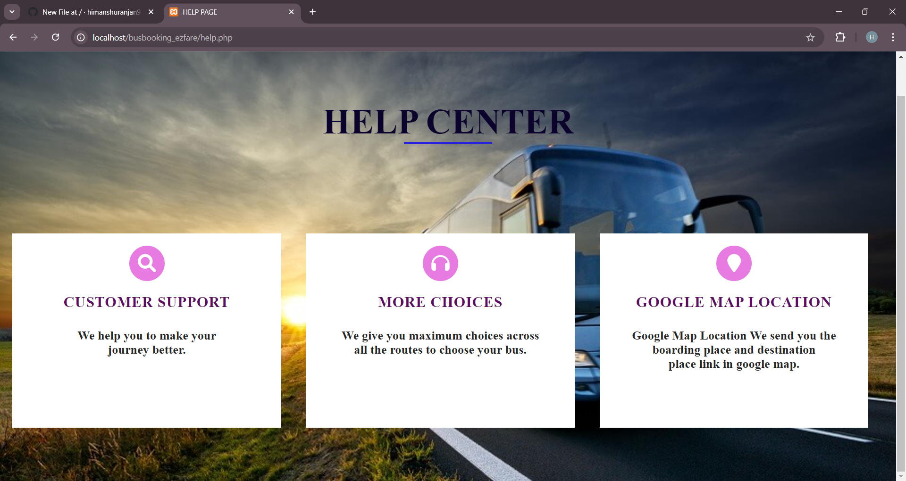
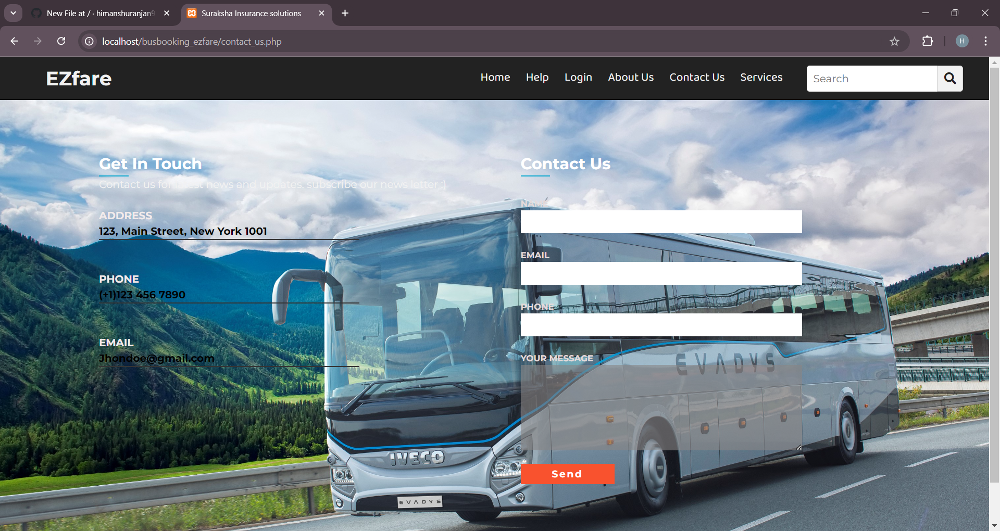

# Busbooking_ezfare

## **Table of Contents**

- [**Description**](#description)
- [**How to setup this project**](#How-to-setup-this-project).
- [**Usage**](#usage)
- [**Technologies Used**](#technologies-used)
- [**Preview**](#preview)
- [**Deployed link**](#deployed-link)
- [**Future Development**](#future-development)
- [**Questions**](#questions)
- [The site is live <a href="https://himanshuranjan977.github.io/Car-Race/" target="_blank">here</a>]
## **Description**

1. **User-Friendly Search and Filters**: Easily search and compare buses by origin, destination, date, and preferences like amenities and price.

2. **Interactive Seat Selection**: Choose and reserve preferred seats using a visual seating chart.

3. **Instant Booking and Digital Tickets**: Get real-time booking confirmations and receive digital tickets via email or SMS.

4. **Multiple Payment Options**: Pay securely using various methods, including cards, mobile wallets, and online banking.

5. **Profile Management and Support**: Create profiles to manage bookings, view history, and access customer support features like chatbots and FAQs.
## **Usage**

1. **Convenient Booking**: Users can book bus tickets from anywhere, anytime, without the need to visit a physical ticket counter.

2. **Real-Time Seat Availability**: Provides real-time information on seat availability, allowing users to choose their preferred seats.

3. **Secure Payment Options**: Offers multiple secure payment methods, making transactions safe and easy for users.

4. **Trip Management**: Users can easily manage their bookings, including options to modify, cancel, or reschedule trips.

5. **Access to Reviews and Ratings**: Provides access to user reviews and ratings of bus operators, helping customers make informed decisions.


## **How to setup this project**
```
Step 1st. Download xampp
```
```
Step 2nd. Text editor notepad++ or Sublime
```
```
Step 3rd. Download the zip file/ Download winrar
```
```
Step 4th. Extract the file and copy “busbooking_ezfare” folder
```
```
Step 5th. Paste inside root directory/ where you install xampp local disk C: drive D: drive E: paste: for xampp/htdocs,
```
```
Step 6th. Open PHPMyAdmin http://localhost/phpmyadmin
```
```
Step 7th. Create database name busbooking_ezfare
```
```
Step 8th. Import busbooking_ezfare.sql file given inside the zip package in SQL file folder
```
```
Step 9th. Run the script http://localhost/ busbooking_ezfare 
```
## **Technologies Used**

* **Language Used**:      PHP

* **Database Used**:      My SQL

* **Design Interface**:    Bootstrap JavaScript, HTML

* **Browser**:                  Opera Mozilla Google Chrome IE8,

* **Software**:                 WAMP/ XAMPP/ LAMP/MAMP

## **Preview**

* **Online Bus Booking system Screen**










* **Final results**


## **Future Development**

1. **Integration with AI and ML**: Implement AI-driven features like personalized recommendations, dynamic pricing, and predictive maintenance alerts for buses.

2. **Expansion of Payment Options**: Introduce diverse payment methods, including cryptocurrency and mobile wallets, to cater to global users.

3. **Enhanced User Experience**: Focus on mobile-first design, with a seamless, intuitive interface and real-time booking updates.

4. **Sustainability Features**: Provide options for carbon offset contributions and highlight eco-friendly travel choices.

5. **Multi-Modal Transport Integration**: Incorporate booking options for other transport modes (e.g., trains, taxis) within the same platform for end-to-end travel planning.


## **Questions**

* Contact me on my GitHub profile: [Himanshu's GitHub](https://github.com/himanshuranjan977)
